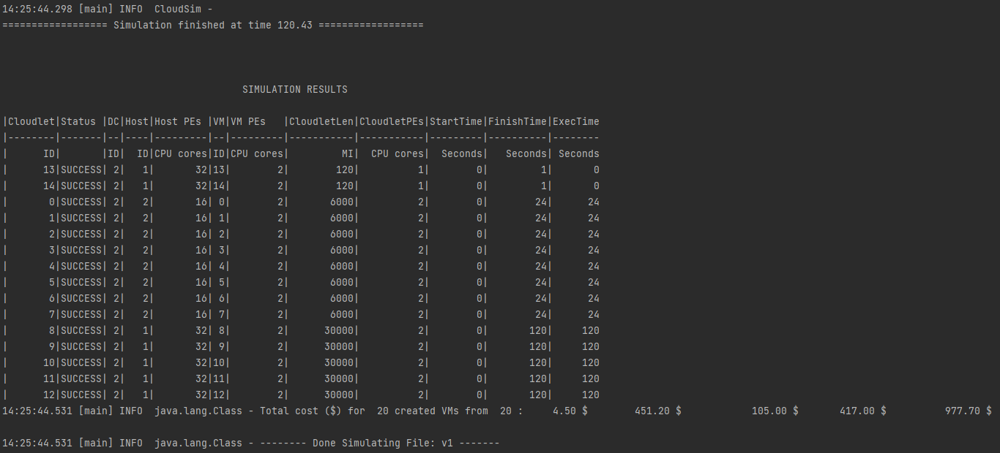
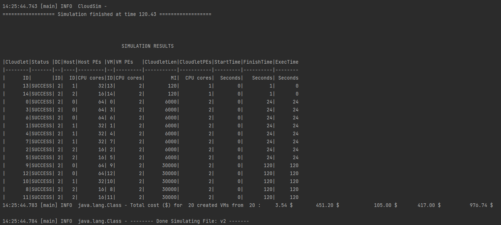
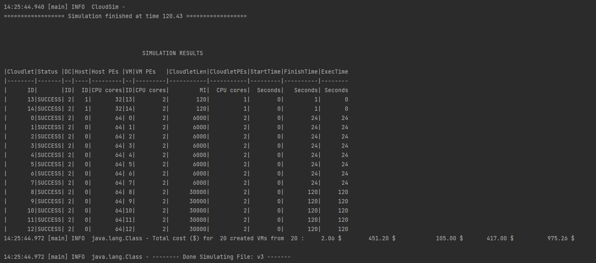
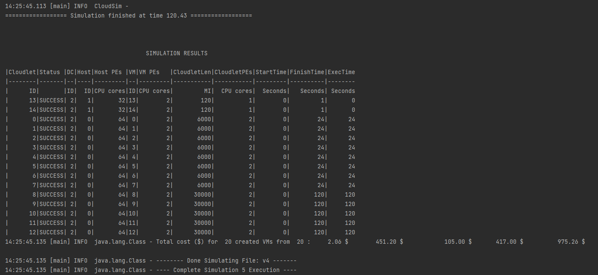

# Allocation Policy Comparison

Compare different VM Allocation Policies like BestFit, RoundRobin, FirstFit and Simple Allocation.

## Simulation Details:

We use the same simulation configuration (number of datacenters, hosts, network, cloudlets) but with different VM Allocation Polcies.

We run this Simulation 4 times, with BestFit, RoundRobin, FirstFit and Simple Policies to compare their performances. 

## Results:

### BestFit Allocation

### RoundRobin Allocation

### FirstFit Allocation

### Simple Allocation

## Observation:

VM Allocation Policies are algorithms used to allocate VMs to the Hosts. 

- BestFit policy chooses hosts with most number of available PEs.
- RoundRobin policy uses Round Robin approach in allocating the VMs to the hosts.
- FirstFit policy assigns the VM to the first available host that can accomodate the requirement.
- Simple policy is a worst fit policy, where it chooses host with the fewest PE's in use.

Allocation policy has no impact on the Cost metric in these four examples, as they all execute in the same time. Further investigation is needed on how highly variable cloudlets have an impact on the costs of execution.

From the screenshots it is visible that in each simulations, the VM's are allocated to hosts differently, except for the first fit and the Simple Allocation.

In Round Robin, it is visible from the result that the VM's are allocated in a sequential manner. 
VM number 0 is allocated to Host 0, Vm 1 is allocated to Host 1, Vm2 is allocated to Host2, Vm3 is back again allocated to Host3 and so on.

In BestFit, Vms (0 to 12) are all assigned to Host 2, as Host2 is the best fit for multiple of these VM's to run. Once there is no more room in Host2, it allocates the remaining VMs to Host1.

For the given configuration of the Organization and Client request, we couldnt differentiate between First fit and Simple Allocation logic.

[<< Back to Index](README.md)