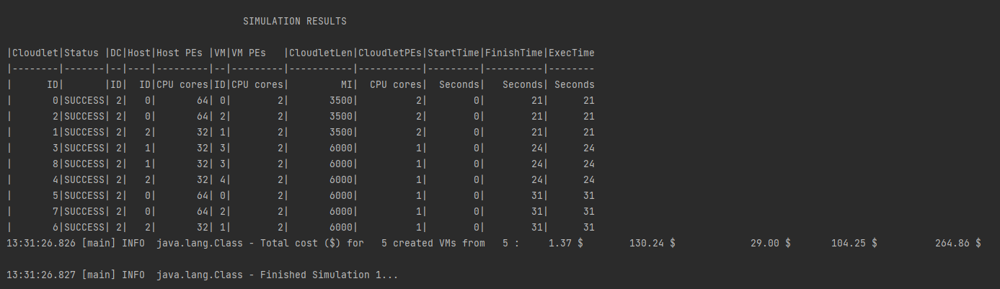

# IAAS DataCenter Simulation

Following factors are considered for this simulation project.

#### IAAS - Level of Control:

&nbsp;&nbsp; **Org:** Host Configurations, Network Topology, Allocation Policies.

&nbsp;&nbsp; **Client:** Select VMs, number of VMs, OS, Cloudlets to be deployed in the VMs, Cloudlet Scheduling Policies, etc.

## Simulation Details:

- Resources/Configurations of the IAAS Organization: [org.config](https://github.com/laxmena/CloudOrg-Simulator/blob/main/src/main/resources/simulation1/org.conf)
- List of resources Client requests to the IAAS Organization: [client.config](https://github.com/laxmena/CloudOrg-Simulator/blob/main/src/main/resources/simulation1/client.conf)

IAAS Organization by default only has the hosts, and no VM's configured. VM's on-demand from the clients requests.

Client requests 5 VMs in total (3 of 'medium' instance and 2 of 'nano' instance type).

VM Instance types are defined in [instances.config](https://github.com/laxmena/CloudOrg-Simulator/blob/main/src/main/resources/configuration/instances.conf), which is modeled after [AWS Instance Types](https://aws.amazon.com/ec2/instance-types/).

Client don't have control over the configuration of the VM, but client can request certain VM instances based on their requirements.

## Results:

| description | value |
|-------------|-------|
| Total VMs  | 5     |
|Non Idle VMs |  5    |
| Processing Cost | $1.37 |
| Memory Cost | $130.24 |
| Storage Cost | $29.0 |
| Bandwidth Cost | $104.25 |
| Total | $264.86 |

## Observation:

In IAAS, Client don't have control over the host configurations, hypervisor(VMM) or the network topology.
An IAAS client will request infrastructure from the cloud provider and can select the VMs from the instances options that the cloud provider offers.
And has full control over what they do on the VM, but other infrastructure related configurations are maintained by the organization.

If the requesting VM requires more resources than the DataCenter's available resources, it will wait for all the previous VM's to get destroyed and then gets allocated in the host.
Sometimes if the previous VM's are not destroyed, the VM's in the queue may not be allocated resources till the other VM's release them.

Resources scaling and Utilization ration can be made use of to avoid this forever wait queue. 

[<< Back to Index](README.md)