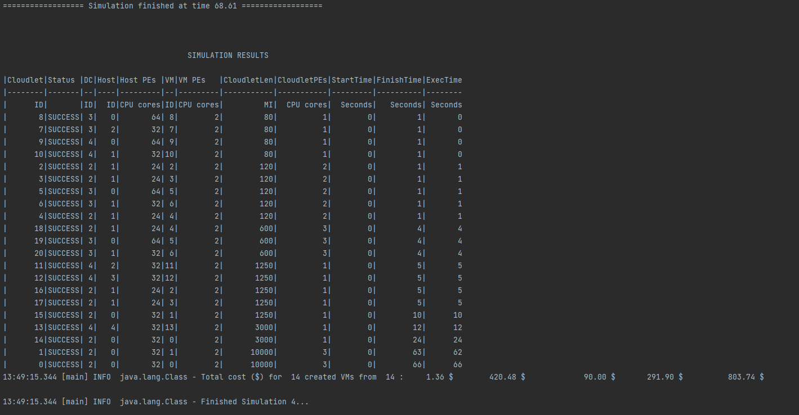

# Multiple Datacenter Simulation

Simulates an Organization that offers all IAAS, PAAS and SAAS services.

Simulates IAAS, PAAS and SAAS Clients.

## Simulation Details:

- Resources/Configurations of the Multiple Datacenter Organization: [org.config](https://github.com/laxmena/CloudOrg-Simulator/blob/main/src/main/resources/simulation4/org.conf)
- List of resources Client requests to the Multiple Datacenter Organization: [client.config](https://github.com/laxmena/CloudOrg-Simulator/blob/main/src/main/resources/simulation4/client.conf)

Cloud Organization has 3 Datacenters, that offers SAAS, IAAS and PAAS services to the clients.
Together, 
- there are 10 hosts (5 in DataCenter 3, 3 in DataCenter 2 and 2 in DataCenter1) all with different configurations.
- Organization also initialized 4 VMs with `nano` configuration and 8 VMs with `medium` configurations.
- Organization deploys 2 cloudlets by default

Client requests the following from the Organization
- 5 Instances of Google Sheets
- 4 Instances of Google Docs
- 2 VMs with `medium` instance type
- 10 Cloudlets in total with varying requirements

## Results:

| description | value |
|-------------|-------|
| Number of Cloudlets  | 21 |
| Number of VMs | 14 |
| Execution Time | 68.61s |
| Processing Cost | $1.36 |
| Memory Cost | $420.48 |
| Storage Cost | $90.00 |
| Bandwidth Cost | $291.90 |
| Total | $803.74 |

## Observation:

Here there are three datacenters, and each one is designated to serve a particular function. But when the resources are not used by the other datacenters, and there are new requests, the available resources can be made use of from the other datacenters.

If there is no available space to run a SAAS cloudlet in SAAS datacenter, and there are resources available in PAAS Datacenter, the system will send the cloudlet to run on the PAAS Datacenter to skip the waiting time in the SAAS Datacenter.

Cloudlets are served to the available VM's, and since there is only one broker that is available for all VM's, it even the VMs requested by the Client to run Cloudlets.
This can be overcome by writing a custom DatacenterBroker logic, which will not allocate Cloudlets to the VMs requested by the user.
Or this can also be overcome by creating multiple brokers.

[<< Back to Index](README.md)