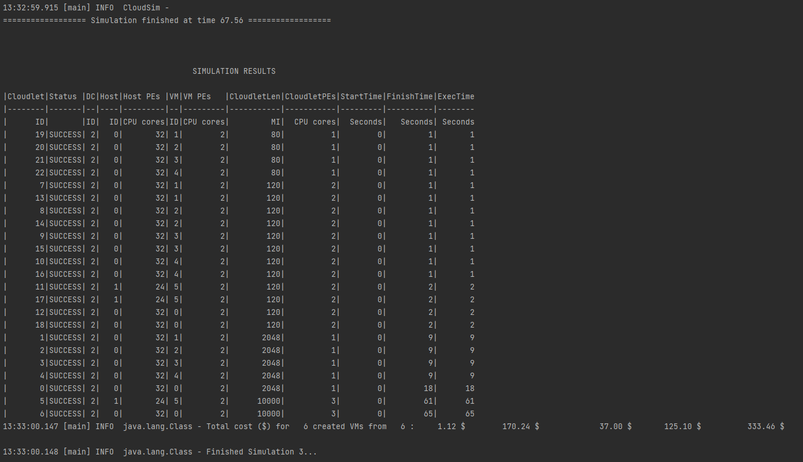

# SAAS DataCenter Simulation

Following factors are considered for this simulation project.

#### SAAS - Level of Control:

&nbsp;&nbsp; **Org:** Host Configurations, Network Topology, Allocation Policies, VM Configurations, Cloudlet Configrations.

&nbsp;&nbsp; **Client:** Number of Cloudlets, and which cloudlet the user is interested to use.

## Simulation Details:

- Resources/Configurations of the SAAS Organization: [org.config](https://github.com/laxmena/CloudOrg-Simulator/blob/main/src/main/resources/simulation3/org.conf)
- List of resources Client requests to the SAAS Organization: [client.config](https://github.com/laxmena/CloudOrg-Simulator/blob/main/src/main/resources/simulation3/client.conf)

Client requests the service that they want to use, and the number of instances of the cloudlets.

This implementation provides two SAAS Software Services - googleSheets and googleDocs.

These definitions are predefined by the organization, and when the user requests for this service, this cloudlet is created by the organization and is sent to VMs for execution.

Example of a Client SAAS service request :
```config
[
    {
        service: "googleSheets",
        count: 2
    },
]
```

In this example, the client request to open two googleSheets software on the SAAS Cloud.

## Results:



| description | value |
|-------------|-------|
| Number googleSheets requested  | 12 |
| Number googleDocs requested  | 4 |
| Number of default Cloudlets | 7 |
| Number of VMs | 6 |
| Execution Time | 67.56s |
| Processing Cost | $1.12 |
| Memory Cost | $170.24 |
| Storage Cost | $37.00 |
| Bandwidth Cost | $125.10 |
| Total | $332.74 |

## Observation:

In SAAS, the client doesn't have any control on what resources each cloudlet, VM or hosts will use or be configured with.

Google Sheets, Google Docs, Gmail are some examples of cloudlets, and the clients have access on which service they use, which order they use and how many instances they use.

This is modeled in this simulation.

The Cloud Organizations will take care of horizontal and vertical scaling of resources, when there is a burst of load for the SAAS Cloudlets.
Scaling and resource allocation is abstracted from the clients and they need not worry about it.

Clients are charged differently for different SAAS services. 
Some services like API's, charge clients for number of API calls.
Some services have subscription options, and it depends on the business model that the services use.


[<< Back to Index](README.md)