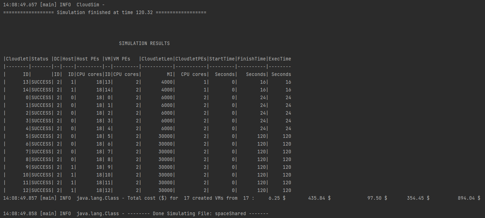
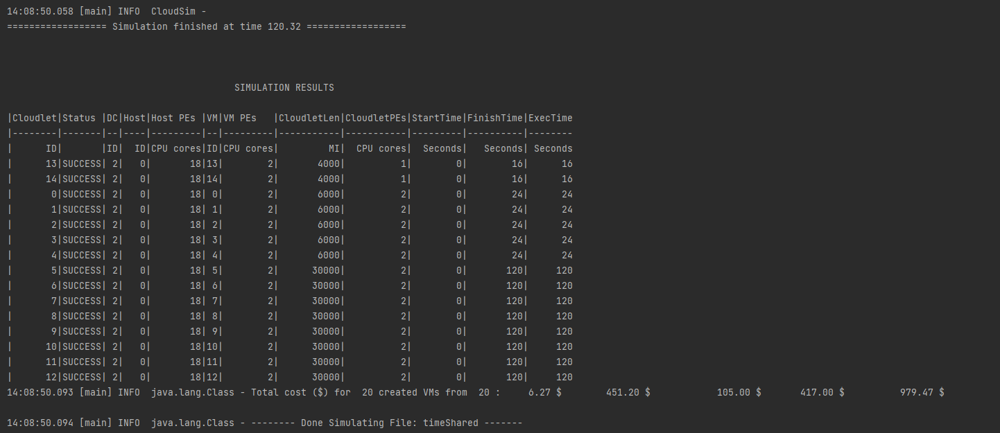
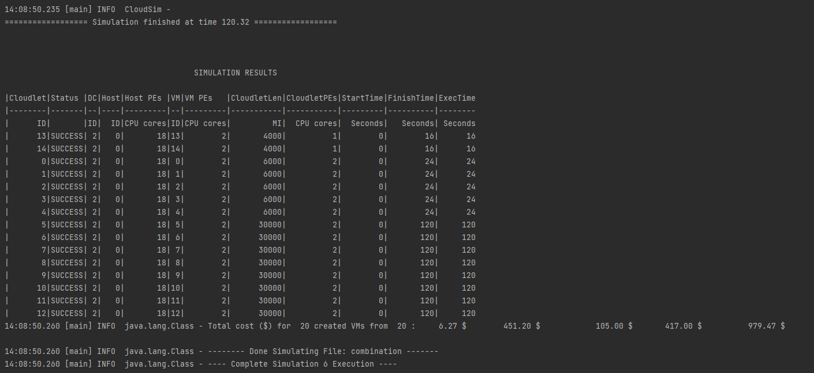

# Allocation Policy Comparison

Compare different VM Scheduling Policies like SpaceShared, TimeShared and (Space + Time) Shared.

## Simulation Details:

We use the same configuration (number of datacenters, hosts, network, cloudlets) but with different VM Scheduling Polices to compare output.

We run this Simulation 3 times,
1. Two hosts with SpaceShared Scheduling
2. Two hosts with TimeShared Scheduling
3. One host with Space Shared, and One with Time Shared Scheduling

Configurations (each file has both Org and Client configurations within):
- [Space Shared](https://github.com/laxmena/CloudOrg-Simulator/tree/main/src/main/resources/simulation6/space.conf)
- [Time Shared](https://github.com/laxmena/CloudOrg-Simulator/tree/main/src/main/resources/simulation6/time.conf)
- [Space + Time Shared](https://github.com/laxmena/CloudOrg-Simulator/tree/main/src/main/resources/simulation6/timeandspace.conf)

## Results:

### SpaceShared Scheduling

### TimeShared Scheduling

### Space + TimeShared Scheduling

## Observation:

**SpaceShared**: Resources like Storage and RAM are shared with multiple components. 
**TimeShared**: CPU Resource is shared among multiple components.

Here one major observation is related to sharing of resources. For this simulation I had to bring down the number of VMs in SpaceShared to 17. 

In SpaceShared scheduling, PE's are concretely allocated to the VM's, so for there were not sufficient PE's available. So the simulation waits indefenitely for the previous VM's to release the resources.

Similarly, in TimeShared, Storage and RAM are concretely allocated to the VM's. When there was no sufficient Storage space, the simulator waits till the previous VM's destroy to make use of the blocked resoures.

Same impact can be seen when with Cloudlet TimeShared Schedulers and SpaceShared Schedulers, in cloudlets allocation to VM's.

[<< Back to Index](README.md)